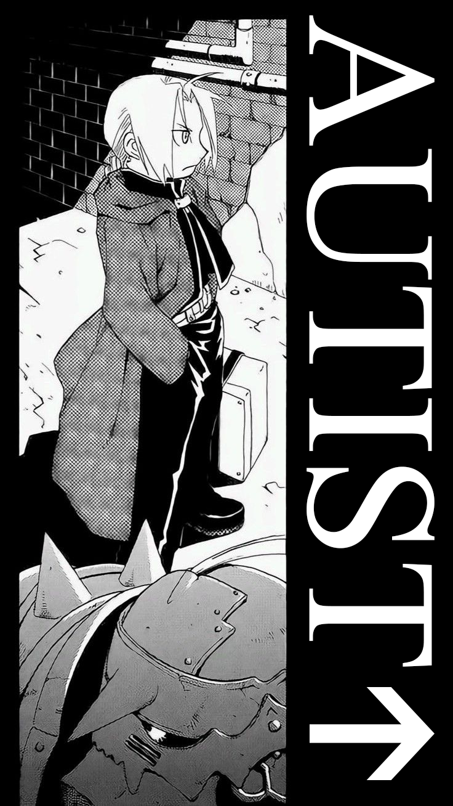

    
    

      <samp>
        hi-ya~
         
         
        i'm lívia (@kyureyumi); a dense programmer and hobbyist linguist. nice to meet ya ^-^
         
        &nbsp; <code>P = she/her ∪ they/them ∪ it/its</code> •<code>L = (🇧🇷, 🇬🇧, 🇪🇸, 🇩🇪)</code>
         
         
        i'm into functional programming, C99, and systems programming, and i'm also interested in reverse engineering
         
         
        my free time <i>online</i> is spent <s>reinventing the wheel for nothing and breaking stable software</s> experimenting
        with atypical technologies and building cool stuff with 'em
         
         
        meow. you may find me elsewhere on a few places on the interwebs:
         
        &nbsp;website ~ <a href="https://kyu.re">kyu.re</a>
         
        &nbsp;discord ~ <a href="https://discord.com/users/365482817041334272">@kyureyumi</a>
         
        &nbsp;bsky ~ <a href="https://bsky.app/profile/did:plc:ccmxjfnlotusblh6nuzc2cfl">bsky.app/profile/kyu.re</a>
         
         
        if u saw me elsewhere, nah u didn't
      </samp>
    

